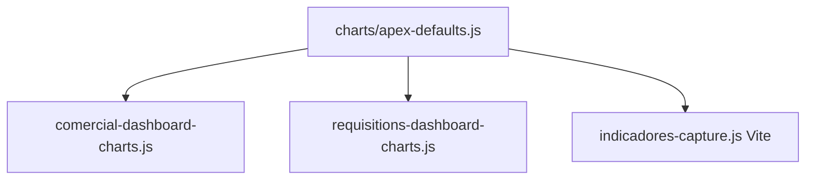

# Plan de orquestacion — FEAT-010

> ApexCharts unificado: GH + Operaciones; retirar Chart.js y ECharts.  
> Piloto Comercial ya entregado (`comercial-dashboard-charts.js`).

## Resumen

| Campo | Valor |
| --- | --- |
| Feature ID | FEAT-010 |
| Modo | orquestado |
| Rama Git | Manuel-E |
| Modulos | requisitions (GH), indicadores/operaciones, shared charts JS |
| Run log | `docs/runs/FEAT-010-run-log.md` |
| shared-files | `vite.config.js`, entries JS, `public/js/indicadores-capture.js`, dashboards Blade, docs Architecture |

## Objetivo

Una sola libreria de graficos (**ApexCharts** via npm/Vite). Eliminar **Chart.js** y **ECharts** (CDN y carga dinamica) del proyecto.

## Decisiones tecnicas fijadas

| Tema | Decision |
| --- | --- |
| Libreria | Solo `apexcharts` (ya en `package.json`) |
| Empaquetado | Entries Vite dedicados; no Apex en `app.js` global |
| Shared | `resources/js/charts/apex-defaults.js` (brand, toolbar off, animations off); Comercial importa defaults |
| GH | `resources/js/requisitions-dashboard-charts.js` + JSON en Blade |
| Operaciones | Migrar `public/js/indicadores-capture.js` → `resources/js/indicadores-capture.js`; charts Apex |
| Backend | Sin cambios de payloads (`$chartData`, `data-chart`) |
| Visual Operaciones | Mixed bar + line Apex; **sin** pictorialBar/cilindro ECharts (equivalencia de datos, look simplificado) |
| Limpieza | Grep cero: `chart.js`, CDN chart, `echarts`, `new Chart(`, `ensureEcharts` |

## Alcance

### Incluye

1. **GH** — [`resources/views/modules/requisitions/dashboard.blade.php`](../views/../../resources/views/modules/requisitions/dashboard.blade.php): quitar Chart.js; 4 graficos Apex (trend/status/city/client).
2. **Operaciones** — captura indicadores: Apex en lugar de ECharts; Vite entry; quitar CDN en `show.blade.php`.
3. **Shared defaults** + refactor ligero Comercial.
4. Tests smoke GH + actualizar `IndicadorCapturePageTest`.
5. Docs: ARCHITECTURE, matriz-clientes, requisitions, indicadores.

### Fuera de alcance

- Cambiar KPIs/filtros/formulas de negocio.
- Replicar pixel-perfect cilindros ECharts.
- Pantallas sin graficos actuales.

## Mapa GH (1:1)

| ID | Chart.js | Apex |
| --- | --- | --- |
| `trendChart` | line + fill | area/line |
| `statusChart` | doughnut | donut |
| `cityChart` | bar horizontal | bar horizontal |
| `clientChart` | bar | bar |

## Secuencia de tareas

| # | Agente | Descripcion | Depende de | Estado |
| --- | --- | --- | --- | --- |
| 1 | AgentSj | FEAT + plan + pausa UX Operaciones | — | OK |
| 2 | Analista | Confirmacion visual (sin cilindro) — usuario OK | 1 | OK (skip formal) |
| 3 | Arquitecto | Brief final FEAT-010 | 2 | OK |
| 4 | Feature | T1–T3: defaults + GH + Operaciones + cleanup | 3 | OK |
| 5 | Revisor | Review diff | 4 | OK (obs.) |
| 6 | Documentador | Docs modulos + Architecture + INDEX | 5 | OK |
| 7 | AgentSj | Checklist cierre | 6 | OK |

## Paralelismo

Ninguno recomendado: shared Vite/defaults + cleanup global; Feature secuencial.

## Puntos de pausa usuario

- Confirmacion Operaciones (sin cilindro): **OK 2026-07-27**
- Post-Revisor si hay blockers.

## Criterios de aceptacion

1. Comercial + GH + captura Operaciones solo con ApexCharts (Vite).
2. Ningun Chart.js ni ECharts en runtime.
3. Filtros GH y captura indicadores OK.
4. Tests smoke verdes; `npm run build` OK.
5. Docs: ApexCharts como estandar del proyecto.

## Referencia piloto

Plan fase 1: `apexcharts_piloto_comercial_43cf9e9c.plan.md` (Comercial ya implementado).
