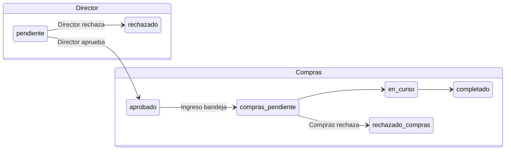

# Modulo: Solicitudes de compra

## Objetivo

Gestionar solicitudes de compra libres (multi-linea, fotos por item), con autorizacion por director seleccionado y procesamiento unificado en **Bandeja compras** junto con suministros aprobados por Calidad.

## Alcance actual

- Creacion multi-linea con foto opcional por articulo (disco `public`; sin cambio en FEAT-030)
- Adjuntos **opcionales** multiples a **nivel solicitud** (no por linea): cotizaciones, ordenes, evidencias. Solo visibles en el detalle autenticado
- Solicitud **Interno** o **Cliente** (campos adicionales de cliente)
- Director aprobador seleccionado en el formulario (usuarios con rol `director` + `purchase.tab.approval`)
- Autorizacion **in-app**: pestaña Pendientes + formulario Aprobar/Rechazar en detalle (`show`)
- Autorizacion **por correo**: enlace firmado (sin login) a `aprobacion-correo/{id}` con formulario guest Aprobar/Rechazar; vigencia configurable (`PURCHASE_EMAIL_APPROVAL_LINK_DAYS`, default 7)
- Correo al director incluye boton **Autorizar por correo** (enlace firmado) y alternativa **Ver en la plataforma**
- Bandeja Compras unificada: solicitudes de compra aprobadas + insumos `aprobada_calidad`, `en_compras` o `completada` (historico visible)
- Export FO-AD-44: PDF y Excel por solicitud de compra; PDF/Excel por suministro en bandeja
- Import legacy desde BD gestion-compras (`purchase-requests:import-legacy`)

## Flujo de estados



| Campo | Valores | Quien cambia |
| --- | --- | --- |
| `estado` | `pendiente`, `aprobado`, `rechazado` | Director asignado |
| `estado_compras` | `pendiente`, `en_curso`, `completado`, `rechazado` | Equipo Compras (solo si `estado=aprobado`) |

Al aprobar el director: `estado_compras` pasa a `pendiente` y se notifica a Compras (destinatarios configurables en tipos de notificacion).

## Rutas

Prefijo autenticado: `/purchase-requests/{module}/`

| Pestana | Permiso | Rutas |
| --- | --- | --- |
| Nueva solicitud | `purchase.tab.create` | `GET/POST purchase-requests.create`, `store` |
| Mis solicitudes | `purchase.tab.my_requests` | `purchase-requests.index`, `show` |
| Pendientes autorizacion | `purchase.tab.approval` | `purchase-requests.approval.index`, `approval.update` |
| Bandeja compras | `purchase.tab.processing` | `purchase-requests.processing.*` |
| Detalle / export / adjuntos (transversal) | Policy `view` | `purchase-requests.show`, `export.pdf`, `export.excel`, `attachments.download` |
| Dashboard Compras | `view.board.compras.dashboard`, `purchase.tab.processing`, o acceso al area Compras | `compras.dashboard` (ver `routes/areas/compras.php`). **No** incluye solo `purchase.tab.approval` (director). |

Rutas publicas (URLs firmadas, sin login):

- `GET purchase-requests/aprobacion-correo/{id}?director={userId}` — formulario guest de autorizacion (vista `email-approval.blade.php`)
- `POST purchase-requests/aprobacion-correo/{id}` — registra aprobacion/rechazo via `PurchaseApprovalService`
- `GET purchase-requests/aprobacion-correo/{id}/pdf` — PDF FO-AD-44 con firma valida

Servicio: `PurchaseEmailApprovalUrlBuilder` genera URLs firmadas para mail y controlador.

Descarga de adjuntos: `GET purchase-requests.attachments.download` (`/solicitud/{purchase_request}/adjuntos/{attachment}`), mismo grupo `auth` + `active` + `password.changed` que `show` (fuera de tabs). `scopeBindings()`: el `{attachment}` debe pertenecer a la solicitud (404 si no). `Gate::authorize('view', $purchaseRequest)`. Disco `local`; no URL publica.

Middleware: `purchase.tab:{tab}` via `EnsurePurchaseTabAccess` + `PurchaseAccessService`.

**Fuera de adjuntos de pedido:** correo al director (`PurchaseRequestCreatedMail`), FO-AD-44 (PDF/Excel) y vista guest `email-approval`. No hay rutas de adjuntos en `routes/modules/purchase-requests-email.php`.

## Permisos y policy

| Permiso | Uso |
| --- | --- |
| `purchase.tab.create` | Crear solicitudes |
| `purchase.tab.my_requests` | Listar propias + ver detalle (policy `view` como dueno) |
| `purchase.tab.approval` | Pendientes + autorizar (policy `approve`) |
| `purchase.tab.processing` | Bandeja y procesamiento (policy `process`) |
| `view.board.{area}.solicitudes_compra` | Alcance sidebar (hogar canonico: area base o Compras) |
| `view.board.compras.bandeja_compras` | Legacy sidebar; la bandeja se accede como pestaña en Solicitudes de compra |

`PurchaseRequestPolicy`:

- `view`: super-admin, compras processing, solicitante, director asignado — tambien autoriza **ver y descargar** adjuntos (sin permiso nuevo)
- `approve`: director asignado + pendiente
- `process`: compras + solicitud aprobada
- `resubmit`: dueno + `estado=rechazado` + `purchase.tab.my_requests` o `purchase.tab.create` — conservar / agregar / quitar adjuntos al reenviar

Directores: rol `director` incluye `view.board.compras.solicitudes_compra` (compras). No incluye autorizacion de requisiciones cargo nuevo (rol `administrador`).

## Navegacion (sidebar)

| Perfil | Entrada en menu |
| --- | --- |
| Solicitante | Su `area_key` → Solicitudes de compra |
| Director | Compras → Solicitudes de compra → Pendientes |
| Compras (analista) | Compras → Solicitudes de compra → pestaña Bandeja compras (landing por defecto); Nueva solicitud / Mis solicitudes segun permisos |

La bandeja **no** aparece como tablero separado en sidebar cuando ya es pestaña del modulo Solicitudes de compra.

Config: `board_canonical_areas.solicitudes_compra` en `config/access.php`. Servicio: `SidebarVisibilityService`.

## Base de datos

### `purchase_requests`

Folio visible: `numero_solicitud` (4 digitos, unico). Campos clave: `area_key`, `solicitud_para`, `urgente`, `aprobador_id`, `estado`, `estado_compras`, `fecha_aprobacion`, `comentarios_director`, `comentarios_compras`, `procesado_compras_at`, `procesado_compras_por`. Sin descripcion/justificacion de cabecera (retirados; el detalle vive en lineas).

### `purchase_request_items`

Lineas: `orden`, `cantidad`, `descripcion`, `referencia`, `utilizacion`, `ubicacion`, `foto_path` (disco `public`).

### `purchase_request_attachments`

Relacion **1:N** con `purchase_requests` (`PurchaseRequest::attachments()`, orden `sort_order` + `id`). Una fila por archivo de soporte de **toda** la solicitud.

| Columna | Tipo | Notas |
| --- | --- | --- |
| `purchase_request_id` | FK | `cascadeOnDelete()` |
| `original_name` | string(255) | Nombre que subio el usuario (`Content-Disposition`) |
| `stored_path` | string(500) | Relativo al disco `local`. Nunca URL publica |
| `mime_type` | string(127) nullable | |
| `size_bytes` | unsignedInteger | |
| `sort_order` | unsignedTinyInteger | 1-based |

Disco: `local` (`storage/app/private`). Path: `purchase-requests/{id}/{uuid}.{ext}` (`config/purchase-requests.php` → `attachments.disk` / `directory`). Topes: `max_files` 5, `max_kilobytes` 10240, `mimes` pdf/doc/docx/xls/xlsx/ppt/pptx/jpg/jpeg/png/webp.

Migracion: `2026_08_28_160752_create_purchase_request_attachments_table.php` (tabla + backfill desde legado + `UPDATE archivo_pedido_path = NULL`). `down()` solo `dropIfExists` de la tabla nueva.

### `purchase_requests.archivo_pedido_path` (deprecada)

Columna **permanece** nullable. **No DROP.** Ya no esta en `$fillable`. Store, resubmit, import y UI **no** la leen ni escriben. Fuente de verdad: `purchase_request_attachments`. Valores previos se copiaron a 1:N (disco `public` → `local` si el fichero existia) y la columna quedo en `NULL`.

Migraciones: `2026_07_31_140100_create_purchase_requests_tables.php`, `2026_08_20_082215_drop_descripcion_justificacion_from_purchase_requests_table.php`, `2026_08_28_160752_create_purchase_request_attachments_table.php`.

## Servicios y controladores

| Componente | Responsabilidad |
| --- | --- |
| `PurchaseRequestController` | CRUD solicitante, show, export PDF/Excel, `downloadAttachment` |
| `PurchaseApprovalController` | Lista pendientes del director, PATCH autorizar |
| `PurchaseProcessingController` | Bandeja unificada, procesar compra/suministro |
| `PurchaseApprovalService` | Resolver aprobacion/rechazo director |
| `PurchaseRequestNotificationService` | Correos director, solicitante, compras; persiste log en `purchase_request_mail_logs` |
| `ComprasQueueService` | Mezcla purchase + supply en bandeja con filtros |
| `ComprasQueueFilterBag` | Parametros de filtro bandeja (fechas, area, tipo, estado compras) |
| `ComprasDashboardService` | KPIs y graficos del dashboard Compras; bandeja usa la misma logica que `ComprasQueueService` |
| `ComprasDashboardController` | Vista `compras/dashboard` (ruta `compras.dashboard`) |
| `PurchaseAccessService` | Tabs visibles, directores (`approversQuery`) |
| `PurchaseEmailApprovalController` | Autorizacion guest por enlace firmado (show/update/pdf). **No** lista adjuntos de pedido |
| `PurchaseRequestAttachmentService` | Guardar en disco `local`, sincronizar en resubmit (keep/quitar/agregar), mapear legado |
| `PurchaseRequestResubmitService` | Reenvio de rechazada (items + adjuntos via attachment service). No toca `archivo_pedido_path` |

Vistas: `resources/views/modules/purchase-requests/` (create, index, show, edit, approval/, processing/, partials/approval-form.blade.php). Dashboard: `resources/views/areas/compras/dashboard.blade.php`.

Control **Adjuntos** en cabecera de `create.blade.php` y `edit.blade.php` (despues de la tabla de productos, antes de Enviar / Reenviar): `attachments[]` multiple, opcional. En edit: `keep_attachment_ids[]` para conservar; quitar en UI elimina el hidden. Detalle `show.blade.php`: bloque Adjuntos (nombre, tamano, enlace `attachments.download`) solo si hay filas. JS: `resources/js/purchase-request-form.js`. **No** en mail, PDF FO-AD-44 ni `email-approval`.

## Bandeja compras — filtros y listado

`ComprasQueueFilterBag` + vista `processing/index` (estilo filtros GH):

| Filtro | Campo / efecto |
| --- | --- |
| Fecha inicio / fin | Compras y suministros: `created_at` (fecha de solicitud) |
| Area solicitante | `area_key` |
| Tipo | `purchase` \| `supply` |
| Estado (pills) | `estado_compras`: pendiente, en_curso, completado, rechazado |

Reglas de volumen (`ComprasQueueService`):

- Sin rango de fechas: maximo **200** registros mas recientes (`truncated` + aviso en UI).
- Con rango de fechas: todos los que coincidan (sin tope).

La tabla DataTables ordena por **fecha descendente** (`data-order` en la columna Fecha) para no empujar los suministros detras de todas las solicitudes de compra (el default `[[0, asc]]` por Tipo ocultaba "Suministro" en paginas siguientes). Los filtros Area/Tipo (searchable-select) autoenvian el GET al cambiar, igual que las fechas.

Acciones por fila: **Ver detalle** (compra → `purchase-requests.show`; suministro → `supplies.show` con `module=area_key` del pedido). **Procesar** sigue en rutas `processing.purchase` / `processing.supply`.

## Dashboard Compras (`compras.dashboard`)

Ruta: `GET /compras/dashboard`. Acceso: permiso `view.board.compras.dashboard`, `purchase.tab.processing`, `view.area.compras` o `manage.area.compras`. El rol **director** (`purchase.tab.approval` solo) **no** accede al dashboard; usa Solicitudes de compra → Pendientes autorizacion.

Filtros globales: **ano**, **mes** (opcional), **area solicitante**, **tipo**.

### KPIs visibles (2026-08-03)

| KPI | Logica | Filtro fecha |
| --- | --- | --- |
| Pendientes director | `estado=pendiente` (solo area) | No usa ano/mes |
| En bandeja | Total en `ComprasQueueService` | Si: convierte ano/mes a `date_from`/`date_to` |
| Bandeja pendiente | `estado_compras=pendiente` (+ suministro `aprobada_calidad`) | Igual que bandeja |
| En curso | `estado_compras=en_curso` (+ suministro `en_compras`) | Igual que bandeja |
| Completadas | Compras: `procesado_compras_at`; suministros: `updated_at` con `status=completada` | Ano/mes del dashboard |

Los KPIs de bandeja enlazan a `purchase-requests.processing.index` con los mismos parametros de fecha/area/tipo. Graficos ApexCharts: tendencia anual, estado solicitudes (periodo), bandeja por estado (periodo), top areas, bandeja por tipo. JS: `resources/js/compras-dashboard-charts.js`.

**Retirados:** KPIs "Solicitudes en periodo" y "Urgentes en bandeja" (2026-08-03).

Conversión dashboard → bandeja: mes seleccionado → primer/ultimo dia del mes; mes "Todos" + ano → `YYYY-01-01` … `YYYY-12-31` (`ComprasQueueFilterBag::dateRangeFromDashboardFilters`).

## Notificaciones

Tipos en `notification_types` (modulo `purchase_requests`):

| Slug | Destinatario | Cuando |
| --- | --- | --- |
| `purchase_request_created` | Director asignado | Al crear (envio sincrono `Mail::send`) |
| `purchase_request_resolved` | Solicitante | Director aprueba/rechaza |
| `purchase_request_approved_for_compras` | Emails configurados | Director aprueba |
| `compras_queue_processed` | Solicitante | Compras actualiza estado |

Correo director: boton principal **Autorizar por correo** (URL firmada a `email-approval.show`) y secundario a `purchase-requests.show` (login requerido en plataforma). Enlaces generados con `PUBLIC_APP_URL` (`App\Support\ApplicationUrls`) para que sean alcanzables desde VPN/red interna. PDF FO-AD-44 adjunto en el correo de nueva solicitud. **Los adjuntos de pedido no viajan en el correo** (ni MIME ni enlaces); el director los consulta en el detalle autenticado.

**Registro de correos:** tabla `purchase_request_mail_logs` (tipo, destinatario, estado `enviado`/`fallido`, detalle, fecha). Visible en detalle de la solicitud. Si falla el envio al crear, aviso amarillo en formulario Nueva solicitud.

## Mis solicitudes

Lista todas las solicitudes creadas por el usuario autenticado (`user_id`), sin filtrar por `area_key` del modulo en la URL (el area elegida al crear puede diferir del tablero desde el que navega).

## Integracion Suministros

`ComprasQueueService` incluye solicitudes de compra aprobadas (todos los `estado_compras`, incluido completado) y suministros con status `aprobada_calidad`, `en_compras` o `completada`. Sin filtro de fechas muestra hasta 200 registros mas recientes; con rango de fechas trae todos los del periodo.

- **Ver detalle** suministro: `supplies.show` — vista alineada a `purchase-requests.show` (metadatos en grid, tabla de lineas, export PDF/Excel FO-AD-44). Si el usuario tiene `purchase.tab.processing`, subnav de Solicitudes de compra y boton "Volver a bandeja".
- **Procesar** suministro: `purchase-requests.processing.supply` (costos, completar).
- Al abrir procesamiento desde bandeja, suministro `aprobada_calidad` pasa a `en_compras`.
- Export FO-AD-44 suministro: `supplies.export.pdf` / `supplies.export.excel` (detalle) o `purchase-requests.processing.supply.pdf` (bandeja).

## FO-AD-44

- Compra: `PurchaseRequestPdfService` → `pdf/purchase-request-solicitud.blade.php`; Excel `PurchaseRequestExcelExporter`
- Suministro: `SupplyPurchasePdfExporter` → `pdf/supply-request-solicitud.blade.php` (**mismo layout visual** que compra); Excel `SupplyPurchaseReportExporter`
- Botones: detalle compra, detalle suministro y bandeja compras (suministro)
- **No** embebe adjuntos de pedido (FEAT-030)

## Import legacy

```bash
php artisan purchase-requests:import-legacy --dry-run
```

Requiere `LEGACY_GESTION_COMPRAS_DB_*` en `.env`. Comando: `ImportLegacyPurchaseRequestsCommand`. Escribe filas 1:N via `PurchaseRequestAttachmentService` (no la columna deprecada). No importa binarios del servidor legado; un path sin fichero puede dejar metadata con download 404.

## Reglas de negocio

- Folio correlativo con lock en transaccion al crear
- Director debe estar en `approversQuery()` (rol director, activo, `purchase.tab.approval`)
- Rechazo director: comentarios obligatorios (`UpdatePurchaseApprovalRequest`)
- Solo solicitudes `aprobado` entran en bandeja Compras
- `show` muestra formulario de autorizacion si `@can('approve', $purchaseRequest)`
- Adjuntos de solicitud **opcionales** (0–5; 10 MB c/u; tipos en config). No alteran estados ni el flujo de autorizacion
- Al **reenviar rechazada**: `keep_attachment_ids[]` + `attachments[]` nuevos; tope combinado 5; quitar todos es valido
- Audit `create` / `resubmit`: metadata `attachments_count` (entero). Sin paths ni nombres de archivo
- Download sin `view`: 403. Adjunto de otra solicitud: 404. Sin auth: redirect login

## Riesgos y pendientes (adjuntos)

- **Tope PHP:** 5 × 10 MB mas fotos de linea puede superar `post_max_size` / `upload_max_filesize` (el POST se descarta antes de Laravel). No se bajo el tope de producto; si falla el envio, revisar php.ini.
- **Huerfanos en disco:** el hook `deleting` borra el fichero si Eloquent elimina el adjunto. Un cascade SQL al borrar la solicitud padre no dispara el evento (aceptable en v1).
- **Tope keep + nuevos en UI:** el servidor rechaza si se supera 5; no hay aviso en cliente (observacion de revision, no bloqueante).

## Pruebas

- `tests/Feature/PurchaseRequestModuleTest.php`
- `tests/Feature/PurchaseRequests/PurchaseRequestAttachmentTest.php`
- `tests/Feature/PurchaseRequests/PurchaseRequestAuditTest.php`
- `tests/Feature/ComprasDashboardTest.php`
- `tests/Feature/RoleDirectorMigrationTest.php`
- `tests/Feature/NavigationVisibilityTest.php`

## Control de cambios

| Fecha | Descripcion |
| --- | --- |
| 2026-07-31 | Modulo inicial: CRUD, bandeja, correos, FO-AD-44, import legacy |
| 2026-07-31 | Autorizacion in-app (correo solo notifica); approval-form en show |
| 2026-08-03 | Hogares canonicos sidebar (`SidebarVisibilityService`); permisos director en seeder/migracion |
| 2026-08-03 | Urgente opcional al crear; Mis solicitudes por usuario; registro de correos en detalle |
| 2026-08-03 | PDF solicitud alineado al detalle (metadatos, estilo FO-AD-44); sin registro de correos |
| 2026-08-03 | Dashboard Compras (`compras.dashboard`): KPIs bandeja, tendencias y graficos ApexCharts |
| 2026-08-03 | Bandeja compras: accion Ver detalle; analista compras ve detalle completo y vuelve a bandeja |
| 2026-08-03 | Navegacion unificada: bandeja solo como pestana en Solicitudes de compra; landing analista en bandeja |
| 2026-08-03 | Bandeja compras: filtros estilo Gestion requisiciones (fechas, pills estado, area/tipo) |
| 2026-08-03 | Bandeja historica completa: completados visibles; limite 200 sin filtro fecha; sin limite con rango |
| 2026-08-03 | Dashboard Compras: KPIs bandeja alineados con `ComprasQueueService` y filtros ano/mes (fecha aprobacion/actualizacion) |
| 2026-08-03 | Dashboard Compras: retirados KPIs Solicitudes en periodo y Urgentes en bandeja |
| 2026-08-03 | Detalle suministro alineado a solicitud compra; export PDF/Excel FO-AD-44 en `supplies.show` |
| 2026-08-03 | PDF suministro FO-AD-44: mismo layout visual que PDF solicitud de compra |
| 2026-08-20 | Retirados campos de cabecera `descripcion` y `justificacion` (formulario, detalle, PDF, correo); detalle solo en lineas |
| 2026-08-04 | Dashboard Compras restringido: director (`purchase.tab.approval`) ya no accede; requiere permiso dashboard, processing o area Compras |
| 2026-08-28 | Bandeja: listado por fecha mas reciente (no por Tipo); filtros searchable-select autoenvian GET |
| 2026-08-28 | FEAT-030: adjuntos opcionales 1:N a nivel solicitud (`purchase_request_attachments`, disco `local`, ruta `attachments.download`, policy `view`). `archivo_pedido_path` deprecada (columna permanece). Fuera: mail, FO-AD-44, guest |

## Referencias

- Guia usuario: [`docs/user/purchase-requests.md`](../user/purchase-requests.md)
- Feature Brief: [`docs/briefs/FEAT-030.md`](../briefs/FEAT-030.md)
- Acceso: [`docs/ACCESS_CONTROL.md`](../ACCESS_CONTROL.md)
- Suministros: [`docs/modules/suministros.md`](suministros.md)
